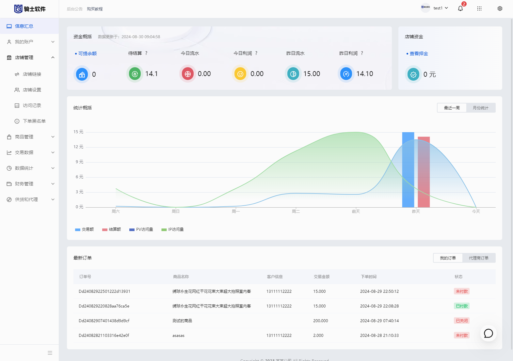

<p align="center">
  
</p>
<p align="center">
  
  
  
</p>

虚拟产品寄售商城系统，发卡源码，vue版发卡源码，高性能发卡源码，企业发卡源码

<a target="_blank" href="https://qm.qq.com/cgi-bin/qm/qr?k=keJuTIHDO3yJAvECJ8gxjGvII5GdvxKa&jump_from=webapi&authKey=fj/1IiYxb+yFoE0RpELS/rd3xaAcaWrOJKDIPZDsKpWX/I7lm1305GzMm8bW9t6r"></a>


# 前端项目

https://gitee.com/wp1208/qs-faka-vue


> 如果项目对您有所帮助，请给项目一个小星星~

# 演示地址

请自行搭建


## 主要特性

> 技术栈：Webman + PHP8 + MYSQL8 + Vite +TypeScript + Vue3 + TDesign Starter

> 有详细的代码注释，有完整系统手册

> Webman框架 使用最新的 Webman 框架开发

> 前端使用Vue CLI框架nodejs打包，页面加载更流畅，用户体验更好

> 标准接口、前后端分离，二次开发更方便

> 支持邮件发送

> 支持短信发送

> 支持事件机制

> JWT权限认证

> 支持使用composer安装扩展


### 自动安装命令

```
wget -O install.sh https://www.qqss.net/free-install.sh && bash install.sh
```

# 系统手册

[手册地址](https://gitee.com/wp1208/faka-qs/wikis/%E7%B3%BB%E7%BB%9F%E4%BB%8B%E7%BB%8D)

[安装手册](https://gitee.com/wp1208/faka-qs/wikis/%E8%AF%A6%E7%BB%86%E5%AE%89%E8%A3%85%E6%AD%A5%E9%AA%A4)

[内置命令行](https://gitee.com/wp1208/faka-qs/wikis/%E5%91%BD%E4%BB%A4%E8%A1%8C)


### 其他

程序作者 QQ：990504246


+ 您可以使用本系统用户学习交流使用，请务必遵守当地法律法规。Enjoy Yourself!!!

# 推荐授权版

本仓库为免费开源版，另外推荐一个已经经过二次开发好的授权版本，商户演示图如下：

